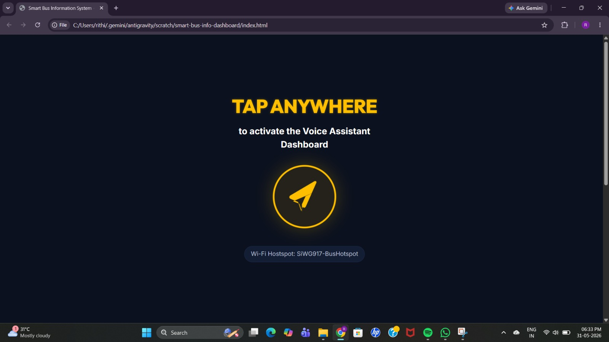
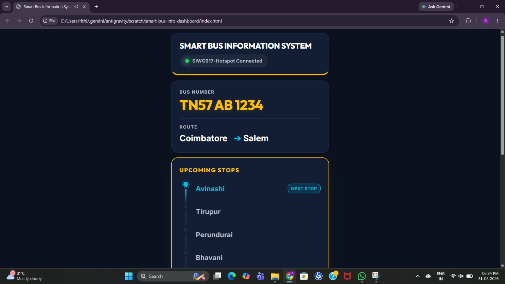
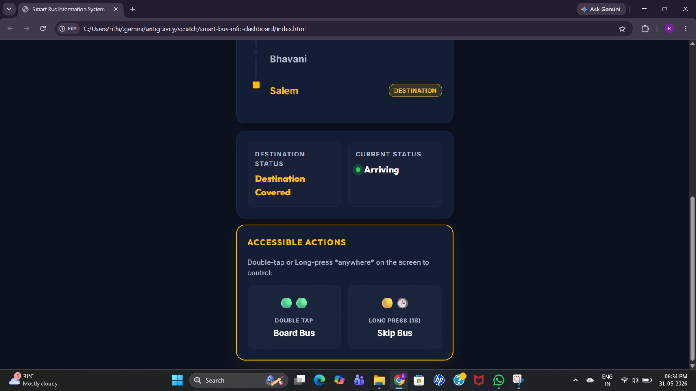
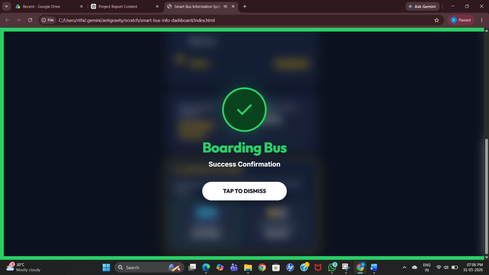
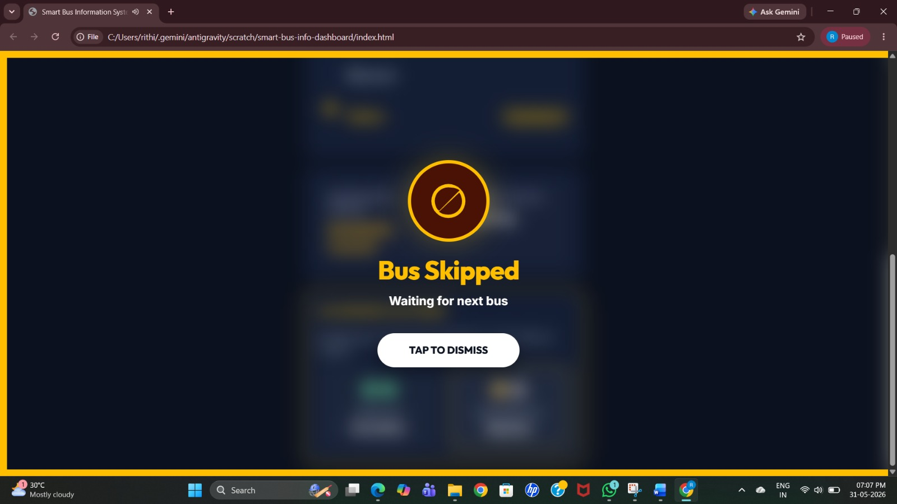

# VoiceBus
VoiceBus is a smart bus information system for visually impaired passengers using the Silicon Labs SiWG917 Wi-Fi 6 MCU. The board broadcasts bus route details via Wi-Fi, while a mobile application retrieves and announces the information using Text-to-Speech.

#  Bus Stop Alert System for Visually Impaired using SiWG917

##  Project Overview

The Bus Stop Alert System for Visually Impaired is an IoT-based accessibility solution developed using the Silicon Labs SiWG917 Wi-Fi MCU.

The system is designed to help visually impaired passengers identify buses and obtain route information independently. Each bus is equipped with a SiWG917 module that acts as a Wi-Fi hotspot and local web server. When a passenger connects to the hotspot, the bus number is automatically shared with the application, which uses it to retrieve and display stored information such as the route details, upcoming stops, and current bus status. The information can also be announced through voice output, improving accessibility and ease of use.

This solution eliminates the need for RFID infrastructure and offers a low-cost, scalable, and easy-to-deploy smart transportation system.


#  Problem Statement

Visually impaired passengers often face challenges in identifying the correct bus and obtaining route information at bus stops.

Traditional solutions such as RFID-based systems require additional infrastructure and specialized hardware, increasing deployment cost and complexity.

There is a need for a simple, low-cost, and accessible solution that allows passengers to receive bus information independently using commonly available devices such as smartphones.


#  Proposed Solution

The proposed system uses the Silicon Labs SiWG917 board as a Wi-Fi hotspot and embedded web server.

Each bus broadcasts its information locally through Wi-Fi. When a passenger connects to the hotspot, bus details are displayed on a smartphone and can be announced through Text-to-Speech (TTS).

The system also supports accessibility gestures such as:

* Double Tap → Board Bus
* Long Press → Skip Bus

This provides an intuitive and accessible interface for visually impaired users.


# Objectives

* Assist visually impaired passengers in identifying buses independently.
* Provide bus route and stop information through voice announcements.
* Develop a low-cost smart transportation accessibility solution.
* Improve public transportation accessibility using IoT technologies.
* Demonstrate the use of Silicon Labs wireless solutions in real-world applications.


#  Hardware Components

| Component            | Description                           |
| -------------------- | ------------------------------------- |
| Silicon Labs SiWG917 | Wi-Fi hotspot and embedded web server |
| Smartphone           | User interface and voice output       |
| USB Power Supply     | Powers the development board          |


#  Software Tools

* Simplicity Studio
* Silicon Labs SDK
* HTML
* CSS
* JavaScript
* Android Studio
* GitHub


#


# Workflow Diagram

### Workflow

1. Bus information is stored on the SiWG917 board.
2. The board creates a Wi-Fi hotspot.
3. Passengers connect to the hotspot.
4. The embedded web server sends bus information.
5. The dashboard displays:

   * Bus Number
   * Route Information
   * Upcoming Stops
   * Current Status
6. Text-to-Speech announces the information.
7. The passenger can confirm boarding or skip the bus using accessibility gestures.


#  Features

* Wi-Fi-based bus identification
* Embedded web server
* Voice announcements using Text-to-Speech
* Bus number identification
* Route information display
* Upcoming stop information
* Accessibility-focused interface
* Double-tap boarding confirmation
* Long-press bus skipping
* Low-cost deployment
* No RFID infrastructure required
* Scalable architecture


#  Silicon Labs Technology Utilized

The project uses the Silicon Labs SiWG917 wireless MCU for:

* Wi-Fi hotspot creation
* Embedded web server hosting
* Wireless communication
* Local information broadcasting
* IoT connectivity
* Low-power operation


# Project Structure

```text
Bus-Stop-Alert-System/
├── README.md
├── LICENSE
├── firmware/
│   └── main.c
├── web-dashboard/
│   ├── index.html
│   ├── styles.css
│   └── app.js
├── hardware/
│   └── Workflow_Diagram.png
├── docs/
    ├── Project_Report.pdf
    ├── Home_Screen.jpeg
    ├── Bus_Information_Screen.jpeg
    ├── Options.jpeg
    ├── Boarding_Confirmation.jpeg
    └── Bus_Skipped_Screen.jpeg
```

#  User Interface Screenshots

## Home Screen



## Bus Information Screen



## Options



## Boarding Confirmation Screen



## Bus Skipped Screen


#  Results

The developed prototype successfully:

✅ Creates a Wi-Fi hotspot using SiWG917

✅ Hosts an embedded web server

✅ Broadcasts bus information locally

✅ Displays route and stop information

✅ Provides Text-to-Speech announcements

✅ Supports accessibility gestures

✅ Demonstrates a low-cost transportation assistance solution


#  Current Development Status

### Completed Modules

* Wi-Fi Hotspot Creation
* Embedded Web Server
* Bus Information Dashboard
* Accessibility User Interface
* Voice Announcement Support
* Boarding and Skip Gesture Controls

### Currently Under Development

* Android Mobile Application
* Automatic Hotspot Detection
* Mobile App Voice Integration

### Testing Status

* Wi-Fi Communication Tested
* Web Dashboard Tested
* Voice Output Verified
* Mobile Application Integration Ongoing


#  Applications

* Smart Transportation Systems
* Public Bus Networks
* Smart Cities
* Accessibility Solutions
* IoT-Based Passenger Assistance Systems
* Inclusive Transportation Infrastructure


# Future Enhancements

* GPS-Based Real-Time Bus Tracking
* Cloud-Based Bus Information Management
* Multi-Language Voice Announcements
* Automatic Nearby Bus Detection
* ETA Prediction
* Smart Bus Stop Integration
* Support for Multiple Bus Operators
* AI-Based Travel Assistance


# License

This project is licensed under the MIT License.


# Authors

Nithya Shree C, Rithika J, Sajitha T, Sowmithra S

Department of Electronics and Communication Engineering

KPR Institute of Engineering and Technology

Powered by Silicon Labs SiWG917
